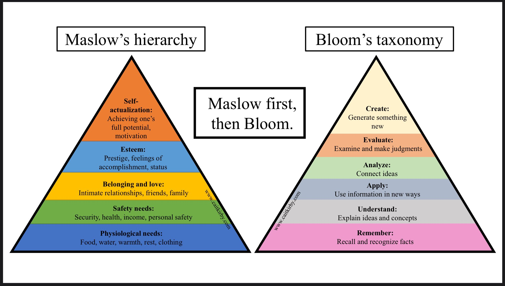

# Welcome

[Twitter](https://twitter.com/foxbaudelaire) | [LinkedIn](https://www.linkedin.com/in/baudelairefox/) | [ORCID](https://orcid.org/0000-0002-5551-6851) | [Test](./other-page.md)

I am a recent graduate of the [Pathways Master's Program](https://lsa.umich.edu/mcdb/graduate-students/pathway-masters-program.html) within the Department of Molecular, Cellular and Developmental Biology at the University of Michigan. My primary research interest is the use of theory and computation from statistical mechanics and neighboring areas of physical chemistry to solve problems in biochemistry and medicine, a focus I aim to develop through a Ph.D. program and further training in mathematical modeling and computer science. In the fall of 2023, I will move abroad to pursue further research experience supported by a [Fulbright Canada Research Award](https://us.fulbrightonline.org/countries/western-hemisphere/canada/1907).

At Michigan, I worked with Randy Stockbridge to write a thesis on considerations of residue coevolution in the Fluc family of membrane channel proteins. Also, I was a member of my representative labor union [(GEO AFT-Michigan Local 3550)](https://www.geo3550.org), assisted the teaching of undergraduate biochemistry in my department as a Graduate Student Instructor, and completed both the [Rackham Professional Development Diversity, Equity, and Inclusion Certificate](https://rackham.umich.edu/professional-development/dei-certificate/) and the [U-M Graduate Teacher Certificate](https://crlt.umich.edu/um.gtc).

In the year before starting the master's program, I worked as a contact tracer with Partners In Health, a technician in the COVID-19 testing lab at the Broad Institute, and finally as a research scientist for Albany Molecular Research Inc. (now Curia, Inc.)

In 2020, I earned a B.S. in biological physics and chemistry from Brandeis University, where I was a recipient of the Ting Tsung and Wei-Fong Chao Endowed Scholarship. I held a position of student leadership and through contributions to student newspaper [_The Justice_](https://www.thejustice.org) I was critical of [institutional underinvestment in teaching and DEI]((https://www.thejustice.org/staff/fox-baudelaire)). As an undergraduate, I contributed to microfluidics research in the Martin A. Fisher School of Physics at Brandeis, funded in part by an affiliated NSF REU program. I also participated in the NIH _Bridges to the Baccalaureate_ research experience at the University of Massachusetts - Boston, where I worked with William Hagar.

Prior to that, I graduated from Bunker Hill Community College and had [experienced homelessness and food insecurity](https://www.circleofhopeonline.org/news/2019/11/21/helping-homeless-college-students-flourish-and-thrive). For most of my time in the Boston area, I was also a bookstore clerk at [BookLink](https://www.boston-airport.com/shops-and-stores/terminal-a/booklink) in Terminal A of Boston Logan International Airport.

At Brandeis, I completed a minor concentration in philosophy. I maintain a broad interest in epistemology, the history and philosophy of science, and questions of value and judgment in scientific practice, especially as they pertain to the participation of minoritized folx in STEM education and participation. I have more ancillary engagement in topics such as the psychology and cognitive science of learning, the intersection of science with public policy, bridging the "two cultures" divide, and the humanistic significance of science.

This page is subject to further construction; more to come.

_"I am, somehow, less interested in the weight and convolutions of Einstein’s brain than in the near certainty that people of equal talent have lived and died in cotton fields and sweatshops."_ — Stephen Jay Gould

_"Knowledge is an unending adventure at the edge of uncertainty."_ — Jacob Bronowski

_"Justice is what love looks like in public."_ — Cornel West

